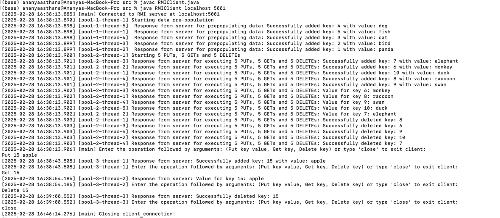
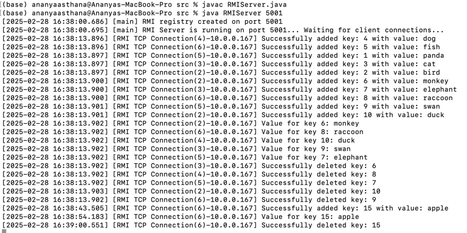

# String Operations RMI Client-Server Program

## Overview
This Java program implements an RMI based client-server application that implements a key value store and allows the user to perform PUT, GET and Delete operations. It also incorporates multithreading, so the server can process multiple client requests simultaneously on different threads. 

On the server side, Java RMI natively handles multithreading, meaning multiple client requests are processed concurrently without extra threading logic, and on the client side we use thread pools to send concurrent requests to the server instead of one after the other. ConcurrentHashMap used for thread safety.

We use one thread pool for prepopulation of data, one thread pool for the 5 PUTs, 5 GETs and 5 Deletes, and one thread pool for taking in user commands and executing them.
## Files
- **RMIServer.java**: Initializes the RMI registry, registers the remote object, and waits for client requests. Manages key-value store operations and logs client interactions.
- **RMIClient.java**: Connects to the server, sends commands, and displays the server results. Uses a fixed-thread pool to send concurrent requests for better performance.
- **KeyValueStoreOperations.java**: Implements the KeyValueStoreOperation interface and contains the Hashmap and PUT, GET, DELETE and ContainsKey logic

## How to Run
Unzip the files and store in your desired location. Then proceed with the given steps:

### 1. **Run the RMI Server**:
1. Open Terminal 1. We will run the RMI server here.
2. Navigate to the folder where the code is saved. Either use 'cd' to enter the src code folder where the unzipped files are or open a new terminal window at the src code folder.
3. Compile the server file:
```bash
javac RMIServer.java
```
4. Provide the port number
```bash 
java RMIServer <port>
````
If no port is provided, the server will ask for it again.

### 2. **Run the TCP Client**:
1. Open Terminal 2. We will run the client here.
2. Navigate to the folder where the code is saved. Either use 'cd' to enter the src code folder where the unzipped files are or open a new terminal window at the src code folder.
3. Compile the client file:
```bash
javac RMIClient.java
```
4. Provide the server address and port number
```bash
java RMIClient <server address> <port>
````

### 5. **Key Value Store operations**:
TOnce your client is up and running it will start to prepopulate the Hashmap with 5 data points by running the following commands:

              "put 1 panda",
              "put 2 bird",
              "put 3 cat",
              "put 4 dog",
              "put 5 fish",

Then it will perform 5 PUT operations, 5 GET operations and 5 DELETE operations as follows:

              "put 6 monkey",
              "put 7 elephant",
              "put 8 raccoon",
              "put 9 swan",
              "put 10 duck",
              "get 6",
              "get 7",
              "get 8",
              "get 9",
              "get 10",
              "delete 6",
              "delete 7",
              "delete 8",
              "delete 9",
              "delete 10",

After this it will prompt the user to input any additional commands they wish to execute, as follows:

        Enter the operation followed by arguments: (Put key value, Get key, Delete key) or type 'close' to exit client:

Enter the operation with the required arguments to complete the operation execution. Enter 'close' to close client connection

### 6. **View Output**:
The responses from the server at every step will be displayed with timestamps and thread IDs on the client window as follows:

[2025-02-28 16:38:13.899] [pool-1-thread-2]  Response from server for prepopulating data: Successfully added key: 1 with value: panda

Similarly, server responses will be displayed in the server window with timestap and RMI thread ID: 

[2025-02-28 16:38:13.897] [RMI TCP Connection(5)-10.0.0.167] Successfully added key: 1 with value: panda


### 5. **Example**:


### Example of Client side execution:



Used 3 thread pools with 5 threads each to perform prepopulation, 5 PUTs, 5 GETs and 5 DELETEs, and command execution

### Example of Server side execution:



Used RMI Connection Threads for multithreading 

#### On Terminal 1: 
```bash

javac RMIServer.java
java RMIServer 5001
```
You will now see this message:
```bash
[2025-02-28 16:38:00.686] [main] RMI registry created on port 5001
[2025-02-28 16:38:00.695] [main] RMI Server is running on port 5001... Waiting for client connections...
```

#### On Terminal 2:
```bash

javac RMIClient.java
java RMIClient localhost 5001
```

You will now see this message:
```bash
[2025-02-28 16:38:13.885] [main] Connected to RMI server at localhost:5001
```
Now you will see all the responses for the prepopulation of data task as well as 5 PUTs, 5 GETs and 5 DELETEs

Next you will be prompted to enter your command as follows:
```bash
[2025-01-31 20:52:26.533] Enter the operation followed by arguments: (Put key value, Get key, Delete key) or type 'close' to exit client:
```

Request:
```bash
Put 15 apple
```
Response on server:
```bash
[2025-02-28 16:38:43.505] [RMI TCP Connection(6)-10.0.0.167] Successfully added key: 15 with value: apple
```
Response on client:
```bash
[2025-02-28 16:38:43.508] [pool-3-thread-1] Response from server: Successfully added key: 15 with value: apple
```
